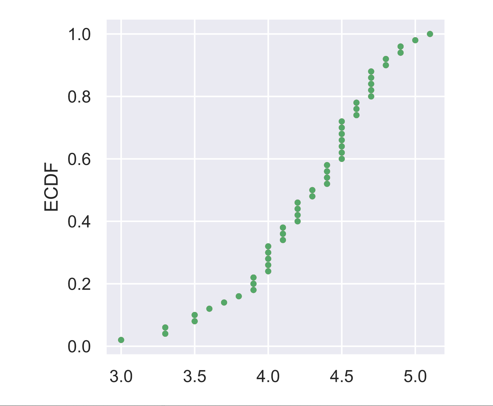

# Plotting the ECDF

#### Explore the data

```text
In [3]: versicolor_petal_length
Out[3]: 
array([4.7, 4.5, 4.9, 4. , 4.6, 4.5, 4.7, 3.3, 4.6, 3.9, 3.5, 4.2, 4. ,
       4.7, 3.6, 4.4, 4.5, 4.1, 4.5, 3.9, 4.8, 4. , 4.9, 4.7, 4.3, 4.4,
       4.8, 5. , 4.5, 3.5, 3.8, 3.7, 3.9, 5.1, 4.5, 4.5, 4.7, 4.4, 4.1,
       4. , 4.4, 4.6, 4. , 3.3, 4.2, 4.2, 4.2, 4.3, 3. , 4.1])
In [4]: len(versicolor_petal_length)
Out[4]: 50
```

* Compute the ecdf of `versicolor_petal_length`  using `ecdf` function.
  * x\_vers, y\_vers = ecdf\(versicolor\_petal\_length\)
* Plot the ECDF as dots. And we are going to `.`  as the `marker`  and remember to specify `linestyle='none'`  and need to pass `x_vers, y_vers`  to `plt.pot()` 
* Finally `plt.show()` to display the plot. Final output will be something like below. 



#### Final Solution for the exercise: 

```text
# Compute ECDF for versicolor data: x_vers, y_vers
x_vers, y_vers = ecdf(versicolor_petal_length)

# Generate plot
plt.plot(x_vers, y_vers, marker='.', linestyle='none')

# Label the axes
plt.ylabel('ECDF')


# Display the plot
plt.show()

```

