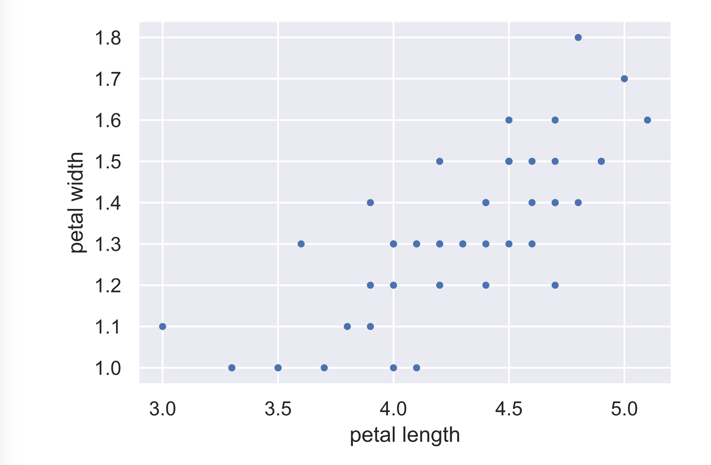

# Scatter plots

```text
# Make a scatter plot
plt.plot(versicolor_petal_length, versicolor_petal_width, marker='.', linestyle='none')


# Label the axes
plt.xlabel('petal length')
plt.ylabel('petal width')


# Show the result
plt.show()
```



