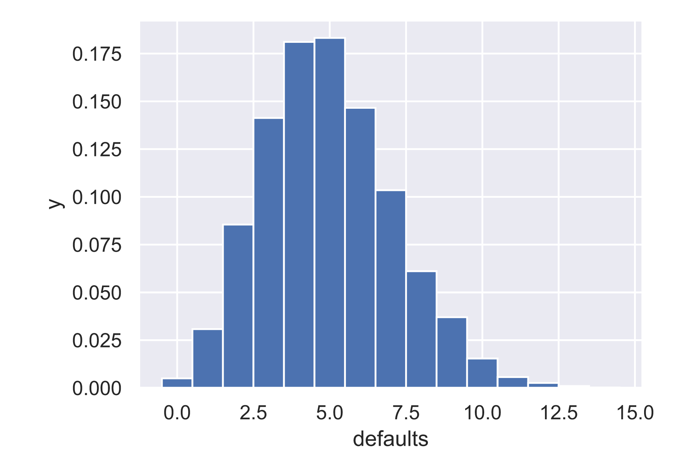

# Plotting the Binomial PMF

```text
# Compute bin edges: bins
bins = np.arange(0, max(n_defaults) + 1.5) - 0.5

# Generate histogram
plt.hist(n_defaults, normed=True, bins=bins)

# Label axes
plt.xlabel('defaults')
plt.ylabel('y')


# Show the plot
plt.show()
```



