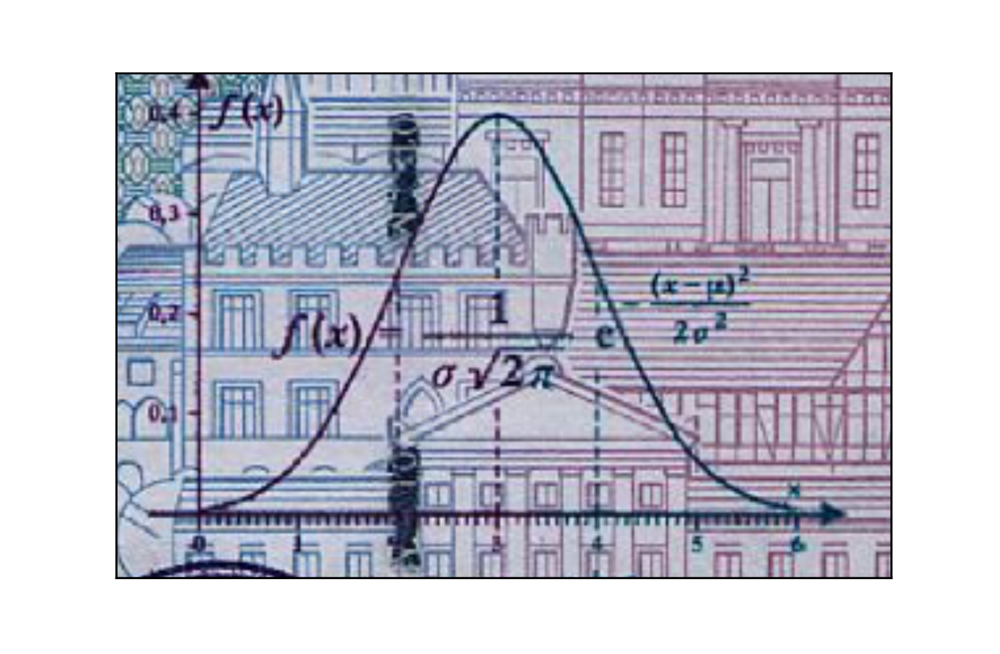

# Gauss and the 10 Deutschmark banknote

What are the mean and standard deviation, respectively, of the Normal distribution that was on the 10 Deutschmark banknote, shown to the right?

`mean: 3, std: 1`

