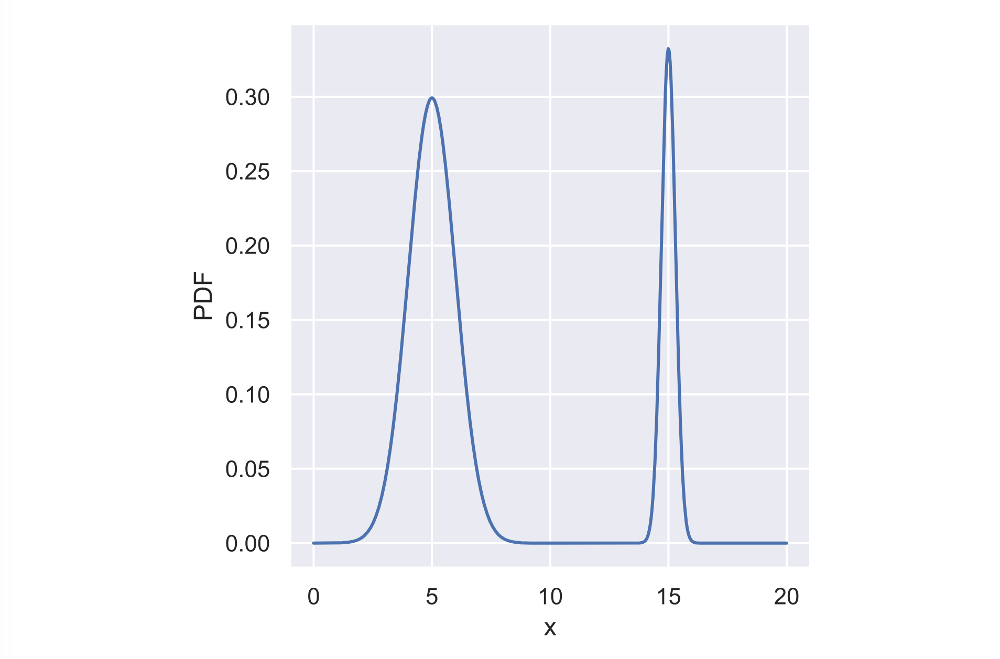

# Interpreting PDFs

Consider the PDF shown to the right \(it may take a second to load!\). Which of the following is true?

`x is more likely to be` **`less than 10`** `than to be greater than 10.`

